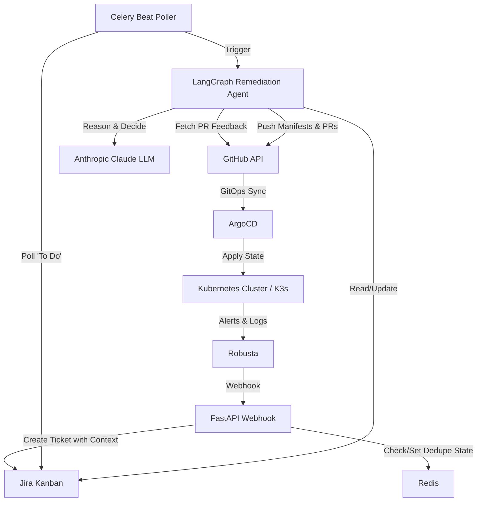

# K8s-Agent
> The Autonomous Site Reliability Engineer for your Kubernetes Cluster.

[](#)
[](#)
[](#)
[](#)
[](LICENSE)

**K8s-Agent** is an **enterprise-grade AIOps framework** for Kubernetes, built in Python, to replace human firefighting with **AI reasoning**.
It leverages a **LangGraph state machine** to autonomously detect, diagnose, and resolve production incidents through a GitOps workflow, combining **Kubernetes**, **Robusta**, **GitHub**, **Jira**, and **Anthropic LLMs** into a unified cognitive architecture.

## Features
- 🔭 **Real-time Observability:** Robusta intercepts Prometheus alerts and sends rich contexts (logs, events, describes) to the agent.
- 🧠 **LangGraph Iterative Remediation:** LangGraph agents pull PR feedback and Jira comments to iteratively write and refine GitOps configuration changes.
- 🛠️ **GitOps Automation:** Modifies configuration, commits to GitHub branches, and opens Pull Requests. ArgoCD syncs the merged changes back to the cluster.
- 🎫 **Incident Management:** Automatically tracks, correlates, and updates incidents in Jira using a 1-hour correlation window, moving actionable items to "To Do" and permanent failures to "In Review".

## Demo
*(Demo video coming soon)*

## Architecture & Technology

### 🗺️ High-level Architecture



### 🧠 Cognitive Architecture (The Brain)
This is an agentic workflow built on **Python**, **Celery**, and **LangGraph**, designed to execute automated remediation while keeping humans in the loop.

- 👁️ **Observe:** Robusta forwards real-time cluster state, logs, and events triggered by Prometheus alerts to the FastAPI webhook.
- 🧭 **Orient:** Interpret symptoms and parse the Jira ticket context alongside any human feedback from GitHub PR comments.
- 🤔 **Decide:** Formulate a remediation plan using Anthropic Claude to determine the necessary YAML manifest modifications.
- ⚙️ **Act:** Push the updated configuration to a Git branch, open a PR, and update the Jira ticket. Wait for human validation or ArgoCD synchronization.

Key building blocks:
- 🧩 **Agentic Nodes:** The remediation graph is split into deterministic nodes: load context, plan remediation, rewrite YAML, validate manifest, self-reflect, and publish PR.
- 🧠 **State Management:** Uses LangGraph's SQLite checkpointer, keying state by `thread_id = remediation:{issue_key}` to ensure continuity across retries and feedback loops.

### 🧰 Toolchain (The Arsenal)
- ☸️ **Robusta & K3s:** Captures native cluster signals and pushes them to the agent.
- 🐙 **GitHub Integration:** Auto-generates branches and Pull Requests to enforce infrastructure-as-code best practices.
- 🧾 **Jira Integration:** Uses Jira as a stateful message bus and human-in-the-loop dashboard.
- 🐳 **Docker Compose:** Seamless local bootstrapping of the entire stack (K3s, Redis, Celery, FastAPI, ArgoCD).

### 🧱 Tech Stack
| Layer | Technology | Purpose |
| --- | --- | --- |
| 🐍 Runtime | Python 3.11 | Modern Python backend |
| 🌱 Framework | FastAPI & Celery | Webhooks, background task workers, and async polling |
| 🧠 Agent Backbone | LangGraph | State machine, tool calling, and LLM orchestration |
| 🧠 LLM | Anthropic Claude | Reasoning and YAML generation |
| ☸️ Kubernetes | K3s + ArgoCD + Robusta | Local cluster simulation, GitOps delivery, and alert routing |
| 🗄️ State | Redis & SQLite | Incident deduplication and LangGraph checkpointing |

## Getting Started

### ✅ Prerequisites
- 🐳 Docker & Docker Compose
- 🔑 Valid API Keys for Anthropic, Jira, and GitHub

### 📦 Installation & Setup
1) Clone the repository:
```bash
git clone https://github.com/FiatLux007/kubernetes-sre-agents.git
cd kubernetes-sre-agents
```

2) Configure credentials via environment variables:
```bash
cp .env.example .env
```
Fill in the real values for `LLM_API_KEY`, `JIRA_USER_EMAIL`, `JIRA_API_TOKEN`, and `GITHUB_TOKEN`. Ensure `DRY_RUN=false` if you want real API integrations.

3) Start the Local Demo Environment:
```bash
./demo up
```
*This spins up the FastAPI server, Celery workers, Redis, and a K3s cluster loaded with Robusta and ArgoCD.*

## Live Demo Scenario (OOMKilled -> Diagnosis -> PR)

### 🧪 Crash Simulation
1) Check the status of the services:
```bash
./demo status
```

2) Trigger a simulated Out of Memory (OOM) incident:
```bash
./demo trigger oom
```

3) Monitor the agent logs:
```bash
./demo logs
```

### 👀 Expected Behavior
- ☸️ **Detect:** Robusta intercepts the OOMKilled signal and sends a webhook containing pod details and logs.
- 🧬 **Correlate & Ticket:** The FastAPI backend deduplicates the alert via Redis and creates a Jira ticket populated with incident context.
- 🤖 **Remediate:** The Celery Beat poller picks up the new Jira ticket and triggers the LangGraph agent.
- 🛠️ **Mitigate:** The LLM diagnoses the issue, suggests an increased memory limit, rewrites the deployment YAML, pushes the change, and opens a GitHub PR.
- ✅ **Review:** The human engineer reviews the PR. If approved, ArgoCD automatically syncs the fix to the cluster. If rejected, the human leaves a comment on the Jira ticket and transitions it back to "To Do" to trigger another AI iteration.
